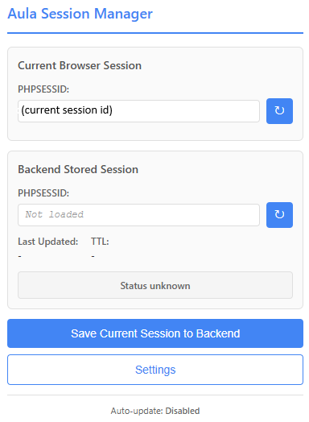

# Aula Login Session Manager

> A Chrome browser extension that monitors and synchronizes PHPSESSID session cookies for Aula.dk with a backend storage system via REST API.


## Table of Contents

- [Overview](#overview)
- [Features](#features)
- [Screenshots](#screenshots)
- [Quick Start](#quick-start)
- [How It Works](#how-it-works)
- [Common Use Cases](#common-use-cases)
- [Related Projects](#related-projects)
- [Usage](#usage)
- [Backend API Requirements](#backend-api-requirements)
- [Project Structure](#project-structure)
- [FAQ](#frequently-asked-questions)
- [Troubleshooting](#troubleshooting)
- [Debugging](#debugging)
- [Security & Privacy](#security--privacy)
- [Technical Details](#technical-details)
- [Development](#development)
- [Contributing](#contributing)
- [Changelog](#changelog)
- [License](#license)

## Overview

This extension automatically detects your Aula.dk session ID (PHPSESSID cookie) and allows you to:
- View your current session ID in real-time
- Save it to a backend storage system
- Compare your browser session with the stored backend session
- Automatically keep the backend synchronized

Perfect for automation scripts, session management tools, or maintaining persistent access to Aula.dk APIs.

## Features

- ✅ **Automatic Session Detection**: Polls every 5 seconds to detect your PHPSESSID cookie
- ✅ **Backend Synchronization**: Save and retrieve session IDs from your REST API
- ✅ **Auto-Update Mode**: Automatically sync when your session changes
- ✅ **Visual Status Indicator**: See at a glance if browser and backend sessions match
- ✅ **Manual Control**: Refresh and save buttons for manual operation
- ✅ **Configurable**: Flexible API endpoint configuration via settings page
- ✅ **Secure**: Works with HttpOnly cookies and path-specific cookies

## Screenshots

*Extension Popup showing current and stored session IDs*



*Note: Screenshots can be added to a `docs/` folder in the repository*

## Quick Start

### Prerequisites

- Google Chrome browser (version 88 or higher)
- Access to www.aula.dk with valid credentials
- Backend REST API for session storage (optional, but recommended)

### Installation

1. **Download or clone this repository**:
   ```bash
   git clone <repository-url>
   cd AulaLoginBrowserExtension
   ```

3. **Load the extension in Chrome**:
   - Open Chrome and go to `chrome://extensions/`
   - Enable **Developer mode** (toggle in top-right corner)
   - Click **Load unpacked**
   - Select the `AulaLoginBrowserExtension` folder
   - The extension icon should appear in your toolbar

4. **Configure your API endpoints**:
   - Click the extension icon
   - Click the **Settings** button
   - Enter your backend API endpoints (see [Backend API Requirements](#backend-api-requirements) below)
   - Click **Save Settings**

5. **Start using**:
   - Navigate to `www.aula.dk` and log in
   - Click the extension icon
   - Your session ID should appear within 5 seconds!

### First Time Setup

After installing the extension, you'll need to configure it:

1. Click the extension icon in your Chrome toolbar
2. Click the **Settings** button at the bottom of the popup
3. In the settings page:
   - Enter your **Retrieve Session Endpoint** (GET URL)
   - Enter your **Save Session Endpoint** (POST URL)
   - Configure **Authentication** (optional but recommended):
     - **Custom Header Name**: Default is `X-aulasession-authenticate` (leave blank to disable auth)
     - **Header Value**: Your authentication token or secret
   - Optionally enable **Auto-update** to automatically sync sessions
   - Click **Test Connection** to verify your retrieve endpoint works
   - Click **Save Settings**

## How It Works


### Backend Synchronization

When you click "Save Current Session to Backend" or when auto-update is enabled:

1. Extension sends your session ID to your backend save endpoint
2. Backend stores the session and returns confirmation
3. Extension displays the stored session details
4. Status indicator shows whether browser and backend sessions match

## Common Use Cases

This extension is particularly useful for storing a valid sessionID for Aula, for the use of other running services.

## Related Projects

This extension is part of a suite of three interconnected projects designed to work with the Aula.dk platform. Each project can be used independently, but together they form a complete solution for Aula session management, API interaction, and automation.

### 🔐 AulaLoginBrowserExtension (This Project)

**Repository**: [github.com/ilenhart/AulaLoginBrowserExtension](https://github.com/ilenhart/AulaLoginBrowserExtension)

**Purpose**: Chrome browser extension for capturing and storing Aula session IDs

**What it does**:
- Automatically detects and extracts your PHPSESSID from www.aula.dk
- Provides a real-time view of your current session
- Synchronizes session IDs with a backend persistence layer via REST API
- Supports custom authentication for secure backend communication
- Can work with any REST backend, or specifically with **AulaNewsletterTS** as a backend

**Use this when**: You need to capture and persist your Aula session ID for use by other services or automation tools.

---

### 📡 AulaApiClient

**Repository**: [github.com/ilenhart/AulaAPIClient](https://github.com/ilenhart/AulaApiClient)

**Purpose**: General-purpose API wrapper for the Aula platform

**What it does**:
- Provides a clean, typed interface for interacting with Aula.dk `/api` endpoints
- Handles authentication using the PHPSESSID session ID
- Wraps common Aula API operations (messages, calendars, profiles, etc.)
- Can be integrated into any Node.js or TypeScript project

**Use this when**: You need to programmatically interact with Aula's API from your own applications or scripts.

---

### 📰 AulaNewsletterTS

**Repository**: [github.com/ilenhart/AulaNewsletterTS](https://github.com/ilenhart/AulaNewsletterTS)

**Purpose**: AWS-based automation platform for Aula with session persistence and AI-powered newsletters

**What it does**:
- Acts as a REST API backend for storing session IDs (compatible with this extension)
- Periodically pings Aula to keep sessions alive  (similar to if you keep Aula open in your browser and occasionally refresh)
- Pulls information from Aula using the **AulaApiClient** library
- Generates AI-powered newsletters from Aula data
- Sends automated email updates
- Deployed as a serverless solution on AWS (Lambda, DynamoDB, SES)

**Use this when**: You want a complete, turnkey solution for Aula automation, session management, and automated newsletters.

---

### How They Work Together

```
┌─────────────────────────────────────────────────────────────┐
│  Browser (www.aula.dk)                                      │
│  ┌────────────────────────────────────┐                     │
│  │  AulaLoginBrowserExtension         │                     │
│  │  • Captures PHPSESSID              │                     │
│  │  • Shows current session           │                     │
│  └────────────────┬───────────────────┘                     │
└───────────────────┼─────────────────────────────────────────┘
                    │
                    │ REST API (POST /session)
                    ▼
┌─────────────────────────────────────────────────────────────┐
│  AWS (AulaNewsletterTS)                                     │
│  ┌────────────────────────────────────┐                     │
│  │  • Stores session ID in DynamoDB   │                     │
│  │  • Keeps session alive (pings)     │                     │
│  │  • Uses AulaApiClient ────────┐    │                     │
│  └────────────────────────────────┼────┘                    │
└───────────────────────────────────┼─────────────────────────┘
                                    │
                                    │ Uses library
                                    ▼
┌─────────────────────────────────────────────────────────────┐
│  AulaApiClient                                              │
│  ┌────────────────────────────────────┐                     │
│  │  • Makes API calls to Aula.dk      │                     │
│  │  • Fetches messages, calendar, etc │                     │
│  │  • Returns structured data         │                     │
│  └────────────────────────────────────┘                     │
└─────────────────────────────────────────────────────────────┘
```

### Usage Scenarios

**Scenario 1: Manual Session Management**
- Use **AulaLoginBrowserExtension** alone to view and manually save your session ID to a simple backend of your choice

**Scenario 2: Custom Integration**
- Use **AulaLoginBrowserExtension** to capture sessions
- Use **AulaApiClient** in your own application to interact with Aula
- Build your own backend for session storage

**Scenario 3: Complete Automation (Recommended)**
- Deploy **AulaNewsletterTS** to AWS
- Install **AulaLoginBrowserExtension** and configure it to use AulaNewsletterTS endpoints
- Extension automatically keeps the backend session updated
- **AulaNewsletterTS** uses **AulaApiClient** to pull data and generate newsletters
- Fully automated Aula monitoring and notifications

### Getting Started with the Full Stack

1. **Deploy AulaNewsletterTS** to AWS (follow its README for deployment instructions)
2. **Install this extension** (AulaLoginBrowserExtension) in Chrome
3. **Configure the extension** to use your AulaNewsletterTS API endpoints
4. **Log into Aula.dk** - the extension will automatically sync your session
5. **AulaNewsletterTS** will handle the rest (keeping session alive, generating newsletters)

Each project has its own detailed documentation in its respective repository.

## Usage

### Viewing Your Session

1. Navigate to `www.aula.dk` and log in
2. Click the extension icon in your toolbar
3. The popup displays:
   - **Current Browser Session**: Your active PHPSESSID
   - **Stored Backend Session**: What's saved in your backend
   - **Created**: When the session was first created
   - **Last Updated**: When the backend was last updated
   - **TTL**: Time-to-live in seconds
   - **Status**: Visual indicator showing if sessions match

### Manually Saving

1. Open the extension popup
2. Click **"Save Current Session to Backend"**
3. Your current session ID is sent to your configured save endpoint
4. Success/error message appears at the bottom

### Refresh Buttons

- Click the **↻** button next to "Current Browser Session" to re-check the browser
- Click the **↻** button next to "Stored Backend Session" to re-fetch from backend

### Auto-Update Mode

Enable this in Settings to automatically sync:

1. Extension detects your browser session ID
2. Fetches the stored session from backend
3. Compares the two values
4. If different, automatically saves the current session to backend

This happens every time the extension detects your session (approximately every 5 seconds when logged into Aula.dk).

## Backend API Requirements

Your backend needs to implement two REST endpoints:

### GET Endpoint (Retrieve Session)

Fetches the currently stored session.

**Endpoint**: Your configured retrieve URL

**Response** (JSON):
```json
{
  "Id": "unique-identifier",
  "sessionId": "o9636vs1olkdh5ft6p84hrl7biumb7m2",
  "created": "2024-10-17T08:15:30Z",
  "lastUpdated": "2024-10-17T12:30:45Z",
  "ttl": 3600
}
```

**Fields**:
- `Id`: Unique identifier for this session record
- `sessionId`: The PHPSESSID value
- `created`: ISO 8601 timestamp when session was first created
- `lastUpdated`: ISO 8601 timestamp of last update
- `ttl`: Time-to-live in seconds

### POST Endpoint (Save Session)

Saves a new session ID.

**Endpoint**: Your configured save URL

**Request Body** (JSON):
```json
{
  "sessionId": "o9636vs1olkdh5ft6p84hrl7biumb7m2"
}
```

**Response** (JSON):
```json
{
  "Id": "unique-identifier",
  "sessionId": "o9636vs1olkdh5ft6p84hrl7biumb7m2",
  "created": "2024-10-17T08:15:30Z",
  "lastUpdated": "2024-10-17T12:35:22Z",
  "ttl": 3600
}
```

### Authentication (Optional but Recommended)

The extension supports custom HTTP header authentication. Configure in Settings:

- **Header Name**: Default is `X-aulasession-authenticate` (can be changed)
- **Header Value**: Your authentication token/secret.  Note this is a value of your choosing, NOT the AulaSession value.

If the header name is blank, no authentication header is sent. The header is included in all GET and POST requests.

**Example with authentication**:
```
GET /api/session
Headers:
  Content-Type: application/json
  X-aulasession-authenticate: your-secret-token-here
```

### CORS Configuration

Your backend must allow requests from `chrome-extension://` origins:

```
Access-Control-Allow-Origin: *
Access-Control-Allow-Methods: GET, POST
Access-Control-Allow-Headers: Content-Type, X-aulasession-authenticate
```

**Note**: Add your custom authentication header name to `Access-Control-Allow-Headers` if you change it.

Or use a more restrictive policy specific to your extension's ID.

## Project Structure

```
AulaLoginBrowserExtension/
├── manifest.json                           # Chrome Extension configuration
├── src/
│   ├── background/
│   │   └── service-worker-standalone.js   # Background worker (active)
│   ├── content/
│   │   └── content-script.js              # Runs on aula.dk pages
│   ├── popup/
│   │   ├── popup.html                     # Extension popup UI
│   │   ├── popup.css                      # Popup styles
│   │   └── popup-standalone.js            # Popup logic (active)
│   └── options/
│       ├── options.html                   # Settings page UI
│       ├── options.css                    # Settings styles
│       └── options-standalone.js          # Settings logic (active)
└── icons/
    ├── icon.svg                            # Source SVG icon
    └── README.txt                          # Icon creation guide
```

**Note**: The extension uses standalone JavaScript files (no build process required). TypeScript files in the repository are for reference only.

## Frequently Asked Questions

### Do I need a backend API to use this extension?

No, you can use the extension to simply view your current PHPSESSID. However, to save and sync sessions, you'll need a backend with the required REST endpoints.

### Why does the extension need the "cookies" permission?

The extension needs to read your PHPSESSID cookie, which is HttpOnly (not accessible via JavaScript in the page). The `chrome.cookies` API requires this permission.

### Is my session data secure?

Yes. Your session ID is:
- Stored locally in Chrome's encrypted storage
- Only sent to your configured backend endpoints
- Never sent to third parties
- Only accessible by this extension

### How often does the extension check for the session?

The extension polls every 5 seconds while Chrome is running. This is efficient and doesn't impact browser performance.

### Can I use this extension for other websites?

Not currently. The extension is specifically designed for Aula.dk and checks the PHPSESSID cookie at the `/api` path specific to that site. However, the code can be modified for other sites.

### What happens if I log out of Aula.dk?

The extension will detect that the PHPSESSID cookie is no longer available and show "Not detected" in the popup. Your backend stored session remains unchanged.  It's possible that directly logging out of Aula will invalidate the session stored in your backend, so it is likely best just to exit the site without logging out.

## Troubleshooting

### Session shows "Not detected"

**Possible causes**:
- You're not logged into Aula.dk
- Cookie hasn't been detected yet (wait 5 seconds)
- Extension error

**Solutions**:
1. Make sure you're logged into `www.aula.dk`
2. Wait 5-10 seconds after logging in
3. Click the refresh button (↻) next to "Current Browser Session"
4. Check service worker console for errors:
   - Go to `chrome://extensions/`
   - Find the extension and click "service worker"
   - Look for errors or "✓ Session poll found PHPSESSID" messages

### Backend connection fails

**Possible causes**:
- Incorrect endpoint URLs
- CORS not configured on backend
- Backend is offline

**Solutions**:
1. Verify endpoint URLs in Settings are correct
2. Click "Test Connection" in Settings page
3. Check your backend server is running and accessible
4. Verify CORS headers are set correctly
5. Check browser console (F12) for network errors

### Sessions don't match

This is **normal** if you just logged in or the backend hasn't been updated yet.

**Solutions**:
1. Click "Save Current Session to Backend" to manually sync
2. Enable "Auto-update" in Settings for automatic syncing
3. Wait 5 seconds for auto-update to trigger (if enabled)

### Settings button doesn't work

**Solution**:
- Reload the extension:
  - Go to `chrome://extensions/`
  - Find the extension
  - Click the reload icon (↻)

## Debugging

### Service Worker Console

View background worker logs:
1. Go to `chrome://extensions/`
2. Find "Aula Login Session Manager"
3. Click "service worker" (blue link)
4. Console opens showing all extension activity

**What to look for**:
- "=== Service Worker Loaded Successfully ===" (extension started)
- "✓ Session poll found PHPSESSID: ..." (session detected)
- "✗ Session poll: PHPSESSID not found" (not logged in)

### Popup Console

View popup logs:
1. Open the extension popup
2. Right-click in the popup window
3. Select "Inspect"
4. Check the Console tab

**What to look for**:
- "DOM loaded, initializing popup..." (popup loading)
- "Current session ID set to: ..." (session retrieved)
- Error messages

### Manual Cookie Check

Test if cookie is accessible in service worker console:

```javascript
chrome.cookies.get({
  url: 'https://www.aula.dk/api',
  name: 'PHPSESSID'
}, console.log);
```

Should return the cookie object with your session ID.

## Security & Privacy

- ✅ Session IDs are stored locally in Chrome's encrypted storage
- ✅ No data is sent to third parties
- ✅ Only communicates with your configured backend endpoints
- ✅ Works with HttpOnly cookies (secure cookies)
- ✅ Supports custom authentication headers for backend security
- ⚠️ Session IDs are sensitive - only use HTTPS backend endpoints
- ⚠️ Use authentication headers to secure your backend API
- ⚠️ PHPSESSID grants access to your Aula.dk account

## Technical Details

- **Chrome Extension Manifest**: Version 3
- **Language**: JavaScript (standalone, no build required)
- **Polling Interval**: Every 5 seconds
- **Cookie Detection**: Uses `chrome.cookies` API (works with HttpOnly)
- **Storage**: `chrome.storage.local` (session cache) and `chrome.storage.sync` (config)
- **Permissions**: `storage`, `cookies`, `webRequest`, `activeTab`

## Development

The extension uses plain JavaScript (no build process):

1. Make changes to `.js` files in `src/`
2. Go to `chrome://extensions/`
3. Click reload icon (↻) on the extension
4. Test your changes

**Active Files** (loaded by extension):
- `src/background/service-worker-standalone.js`
- `src/popup/popup-standalone.js`
- `src/options/options-standalone.js`
- `src/content/content-script.js`

**Reference Files** (not used, kept for documentation):
- TypeScript files (`.ts`) in `src/`
- Service modules in `src/services/`


## Changelog

### Version 1.0.0 (Current)

- ✅ Initial release
- ✅ Automatic PHPSESSID detection via polling (every 5 seconds)
- ✅ HttpOnly cookie support using `chrome.cookies` API
- ✅ Path-specific cookie detection (`/api` path)
- ✅ Backend synchronization with configurable REST endpoints
- ✅ Custom HTTP header authentication support
- ✅ Auto-update mode for automatic session syncing
- ✅ Visual status indicators for session matching
- ✅ Manual refresh and save controls
- ✅ Settings page with endpoint configuration
- ✅ Connection testing functionality

## License

MIT License - see LICENSE file for details

## Support

- **Issues**: Report bugs or request features via [GitHub Issues](repository-issues-url)
- **Documentation**: See [CLAUDE.md](CLAUDE.md) for technical implementation details
- **Questions**: Open a discussion in the repository

## Acknowledgments

Built for managing Aula.dk sessions programmatically while maintaining security and ease of use.

Special thanks to:
- The Chrome Extensions team for Manifest V3 documentation
- Aula.dk for providing the educational platform
- All contributors and users of this extension

---

**Note**: This extension is not officially affiliated with or endorsed by Aula.dk. It is an independent tool created to facilitate session management for automation and development purposes.
